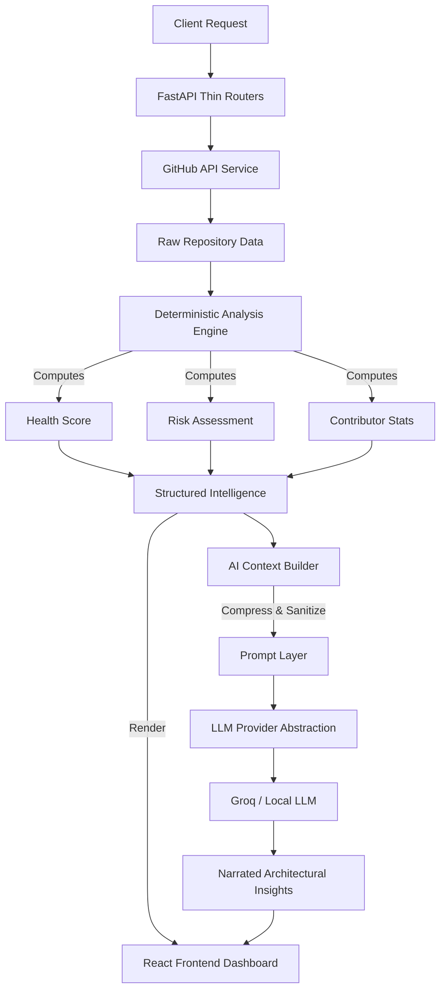

# GitHub Repository Health Analyzer

<p align="center">
  <em>An AI-powered intelligence and health analysis platform for GitHub repositories.</em>
</p>

## 🚀 Overview

The **GitHub Repository Health Analyzer** is an advanced full-stack platform designed to extract, analyze, and narrate the operational health, maintainability, and risk profile of open-source repositories. 

Going beyond standard vanity metrics (stars and forks), this platform leverages a deterministic analytics engine to compute concrete health scores, evaluate contributor bus factors, analyze workload distributions, and track repository evolution. An integrated, modular AI layer then interprets these complex metrics to provide actionable, architect-level insights and recommendations.

**Key Differentiation:** This is *not* a generic codebase chatbot. The architecture strictly separates deterministic quantitative analysis from qualitative LLM interpretation, ensuring that the AI layer acts as an intelligence synthesizer rather than a black-box analyzer.

## ✨ Core Features

* **Deterministic Health Scoring:** Computes holistic repository health based on commit frequency, PR velocity, issue resolution rates, and recency.
* **Contributor Risk Assessment:** Calculates the "bus factor" and visualizes workload distribution using Lorenz curves to identify over-reliance on single developers.
* **Evolution & Structure Tracking:** Analyzes repository tree structures and language composition to gauge architectural complexity.
* **AI-Powered Insights Narration:** Synthesizes raw metrics into human-readable, architect-level narratives and actionable recommendations.
* **High-Performance Dashboard:** Interactive, real-time visualizations powered by Chart.js.

## 🛠 Tech Stack

### Frontend Architecture
* **Framework:** React.js
* **Visualizations:** Chart.js for dynamic, interactive data representation
* **Styling:** Custom CSS3 with a focus on modern, responsive design principles

### Backend Architecture
* **Framework:** FastAPI (Python)
* **Server:** Uvicorn (ASGI)
* **Data Validation:** Pydantic
* **Analysis Engine:** Custom pandas-based deterministic calculation pipelines
* **External APIs:** GitHub REST API

### AI Infrastructure
* **Providers:** Groq API (Primary), Ollama Support (Local fallback)
* **Integration:** OpenAI-compatible inference architecture
* **Engineering:** Custom context-building engine, externalized prompt templates, token-aware truncation

## 📐 System Architecture

The system is designed around a **Modular Service-Oriented Backend** emphasizing separation of concerns, scalability, and maintainability.

### Request Flow & AI Pipeline



### Engineering Decisions & Design Philosophy

1. **Thin Routers & Fat Services:** API endpoints (routers) handle strictly HTTP request/response validation. All business logic, GitHub API communication, and data transformations are encapsulated within the `services/` and `analysis/` layers.
2. **Deterministic Source of Truth:** The `analysis/` engine calculates verifiable metrics (e.g., merge ratios, standard deviations of commit frequencies). The AI layer *never* calculates metrics; it only interprets them. This prevents LLM hallucinations in critical data points.
3. **Provider Abstraction Pattern:** The AI layer communicates through an `llm_service` abstraction. Switching between Groq, OpenAI, or a local Ollama model requires zero changes to the business logic, only a change in environment variables.
4. **Token-Aware Context Building:** Sending entire codebases to an LLM is inefficient and error-prone. The `context_builder.py` aggregates and compresses the outputs of the deterministic engine, ensuring the LLM receives high-signal, low-noise context while strictly adhering to token budgets.
5. **Externalized Prompts:** Prompts are stored as `.txt` templates, decoupled from Python code. This allows prompt engineers to iterate independently of backend deployment cycles.

## 📁 Repository Structure

```text
github-repo-health-analyzer/
├── frontend/                  # React SPA
│   ├── src/
│   │   ├── components/        # Reusable UI elements
│   │   ├── charts/            # Chart.js visualization wrappers
│   │   ├── pages/             # Route views (Dashboard, Risk, AI Analysis)
│   │   └── api.js             # API client
│
├── backend/                   # FastAPI Backend
│   ├── main.py                # Application entry point
│   ├── routers/               # Thin HTTP handlers
│   ├── models/                # Pydantic schemas
│   ├── services/              # Core business logic & GitHub integration
│   ├── analysis/              # Deterministic pandas analytics engine
│   └── ai/                    # AI Integration Layer
│       ├── providers/         # LLM SDK wrappers (Groq, NVIDIA)
│       ├── services/          # Context building & AI orchestration
│       ├── utils/             # Token management & prompt loading
│       └── prompts/           # Externalized prompt templates
```

## ⚙️ Installation & Setup

### Prerequisites
* Node.js (v18+)
* Python (3.9+)
* GitHub Personal Access Token (for increased rate limits)
* Groq API Key (for AI features)

### Backend Setup

1. Navigate to the backend directory:
   ```bash
   cd backend
   ```
2. Create and activate a virtual environment:
   ```bash
   python -m venv venv
   source venv/bin/activate  # On Windows: venv\Scripts\activate
   ```
3. Install dependencies:
   ```bash
   pip install -r requirements.txt
   ```
4. Configure Environment Variables:
   Create a `.env` file in the project root:
   ```env
   GITHUB_TOKEN=your_github_pat_here
   GROQ_API_KEY=your_groq_api_key_here
   PROVIDER=groq
   MODEL_NAME=llama3-8b-8192
   ```
5. Start the FastAPI server:
   ```bash
   uvicorn main:app --reload
   ```

### Frontend Setup

1. Navigate to the frontend directory:
   ```bash
   cd frontend
   ```
2. Install dependencies:
   ```bash
   npm install
   ```
3. Start the development server:
   ```bash
   npm start
   ```

## 🔌 Core API Endpoints

* `GET /health` - API system health and GitHub rate-limit status.
* `GET /repo/health/{owner}/{repo}` - Comprehensive repository health metrics.
* `GET /risk/{owner}/{repo}` - Contributor bus factor and PR/Issue backlog risks.
* `GET /commits/{owner}/{repo}` - Commit frequency and velocity analysis.
* `POST /ai/summary` - Generates an AI narration based on the repository's deterministic metrics.

## 🗺 Future Roadmap

* **Caching Layer:** Implement Redis or in-memory TTL caching for GitHub API responses to optimize rate limit consumption.
* **Webhooks Integration:** Support for real-time repository analysis via GitHub Webhooks.
* **Historical Trending:** Persistent database storage (e.g., PostgreSQL) to track repository health degradation or improvement over months/years.
* **Local LLM Fallback:** Full integration with local Ollama instances for completely private, air-gapped analysis.

---
<p align="center">
  Designed with a focus on scalable architecture and clean engineering principles.
</p>
